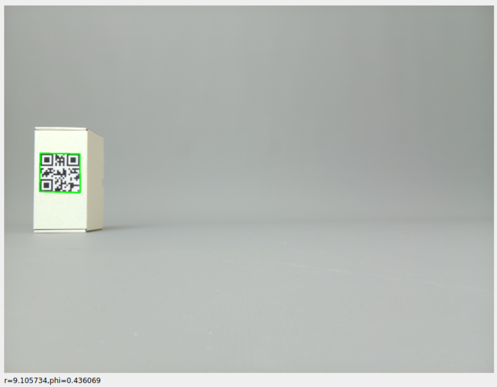
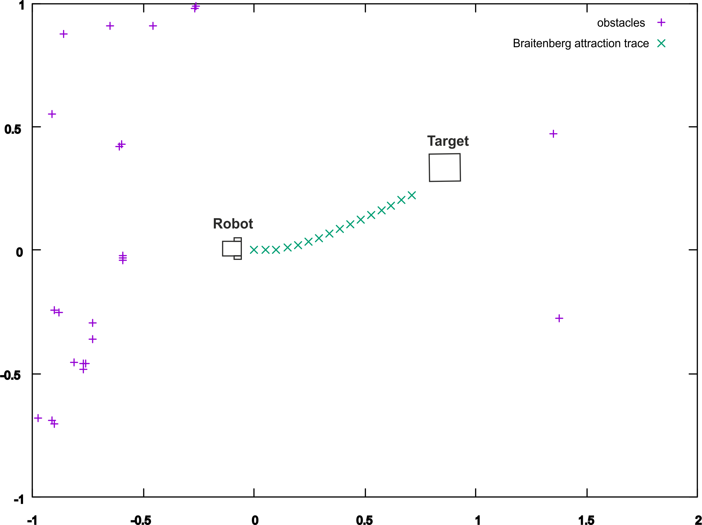
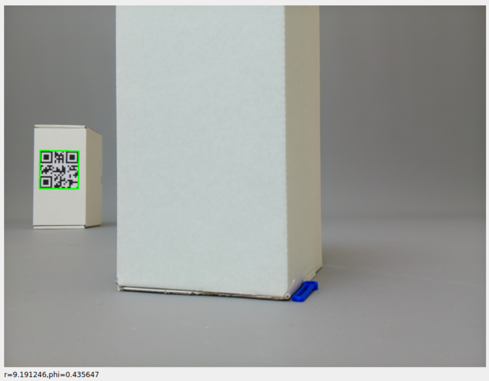
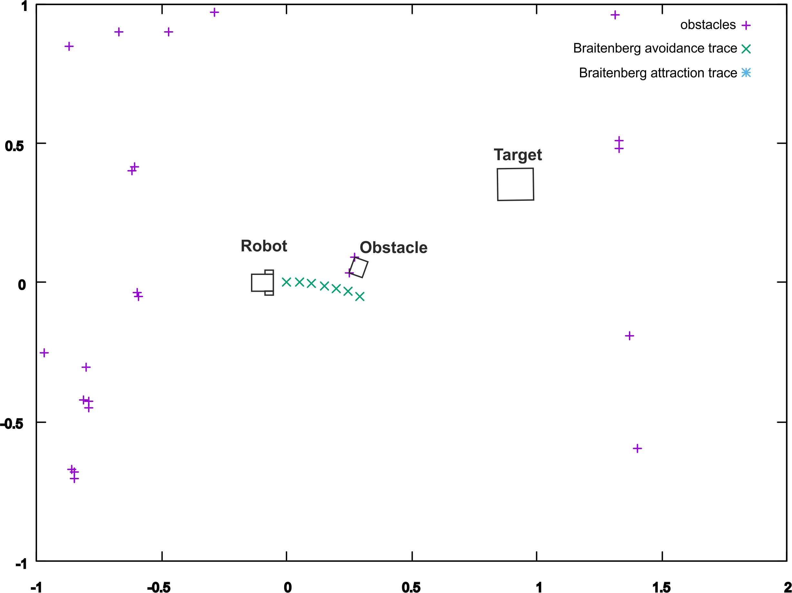
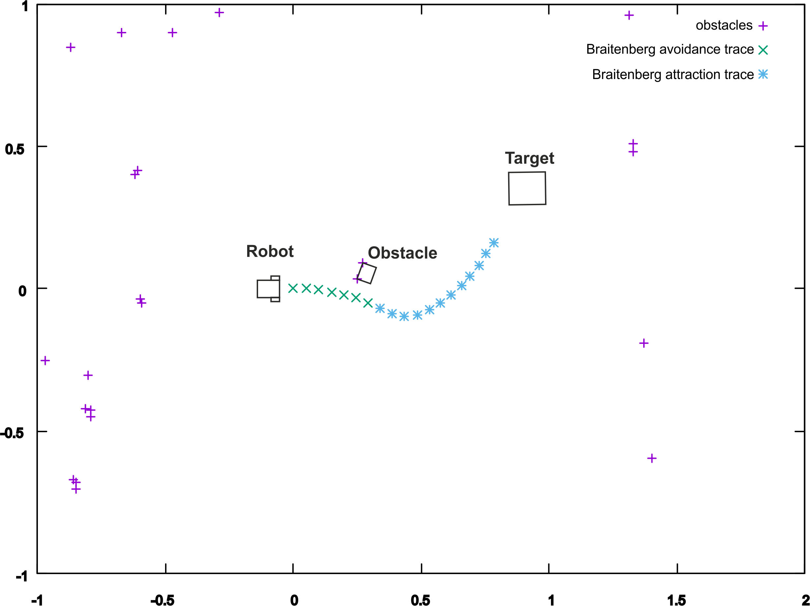

# Bratmobile V4

This is work in progress towards true mapless navigation.

Status: the simulation of the chaining of Braitenberg vehicles works.

The navigation problem is broken down into attraction and avoidance Braitenberg behaviours, called Tasks. A supervising module, called the Configurator, can simulate sequences of Tasks to build up a plan and represents the robot's [Core Knowledge](https://www.harvardlds.org/wp-content/uploads/2017/01/SpelkeKinzler07-1.pdf) (Spelke, 2007).

## Features:
* Hybrid state-space representation
  
* Mapless navigation

* Plans are made up of multiple Tasks, not trajectories

* Pure event driven processing where the tasks receive sensor events and emit both motor actions and termination events to hand over to the next task!

## Hardware
The indoor robot is equipped with 
* Raspberry Pi model 5
* [Zetabot with 360 Parallax Continuous Rotation Servo motors and stereo cameras](https://github.com/berndporr/zetabot))
* [C1 SLAMTEC LIDAR](https://github.com/berndporr/c1lidar)

## Prerequisites
### Development packages

```
sudo apt install g++ cmake libopencv-dev libboost-all-dev xorg-dev libglu1-mesa-dev libgtest-dev xauth x11-apps xfonts-base
```

### Libraries to compile from source

* [C1 LIDAR API](https://github.com/berndporr/c1lidar)
* [Zetabot API](https://github.com/berndporr/zetabot)
* [libcamera2opencv](https://github.com/berndporr/libcamera2opencv)

### Install powersave service

The rpi5 draws too much current under load to run off the battery so we need to enable powersave:

sudo cp powersave.service /etc/systemd/system
sudo systemctl enable --now powersave.service


## Build

```
cd bratmobile
git checkout brat4target
cmake .
make
```

## Simulation tests

The program below tests the simulation of:
 - Braitenberg targeting behaviour
 - Braitenberg obstacle avoidance and
 - *chaining* these to arrive at a plan

```
cd test
test_simulation
```

It also outputs the real steering commands for a real robot
so that it can also be used on a real robot.

### Targeting behaviour




### Avoidance behaviour




### Chain of avoidance and targeting behaviour




## Tests

`test_tasks` tests the input/output processing of the different
tasks if they generate events according sensor inputs.

`test_worldbuilder` tests if the raw LIDAR scan has been
translated into box2d objects to be able to run simulations.

## Credits
 - Bernd Porr
 - Giulia Lafratta
 
